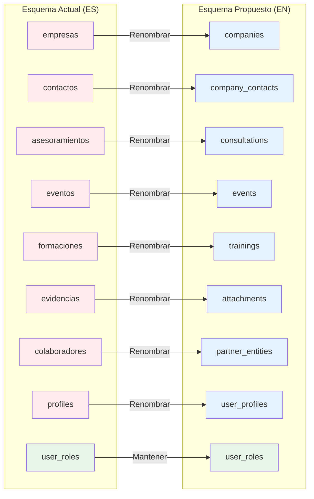
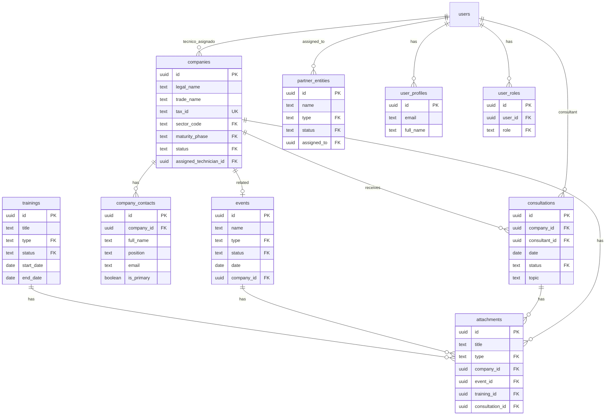
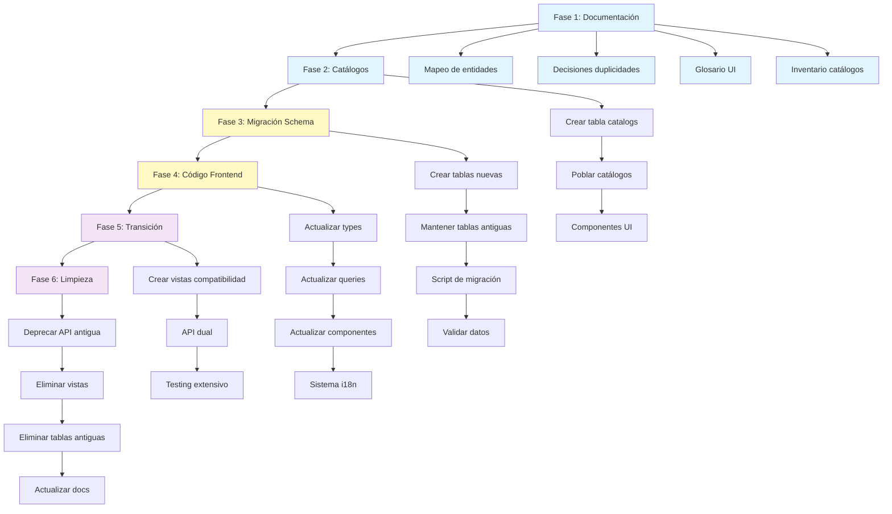
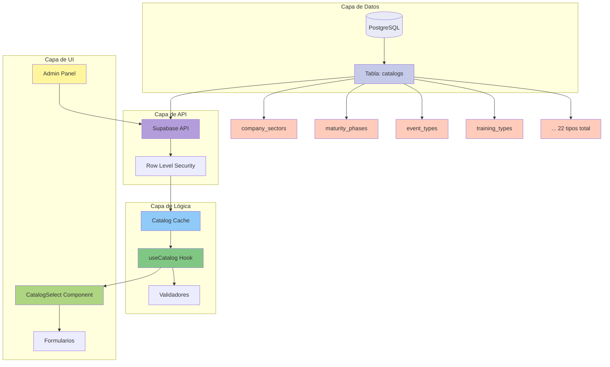
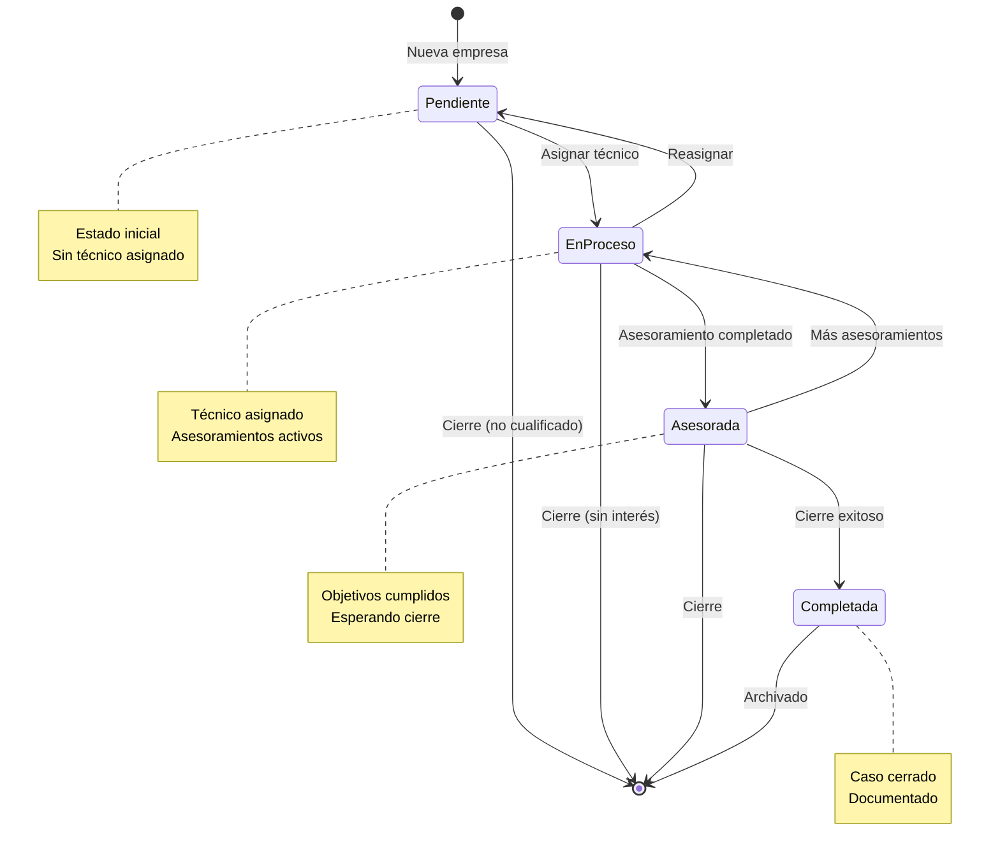
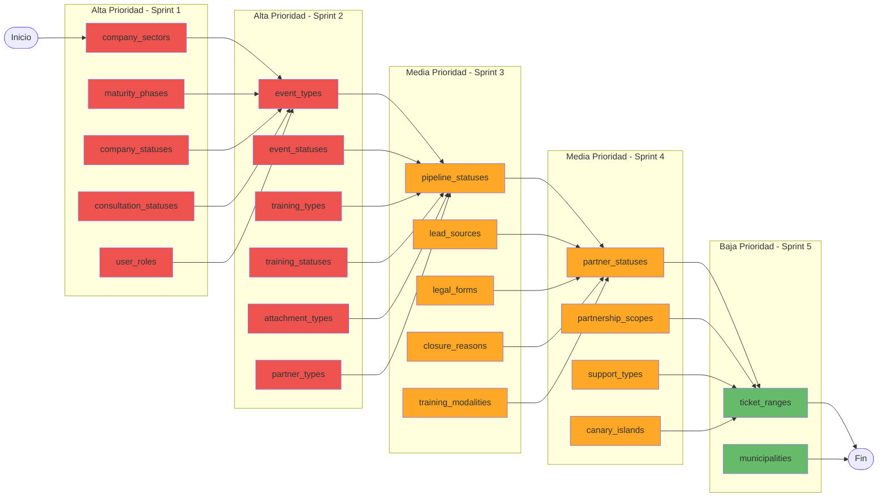
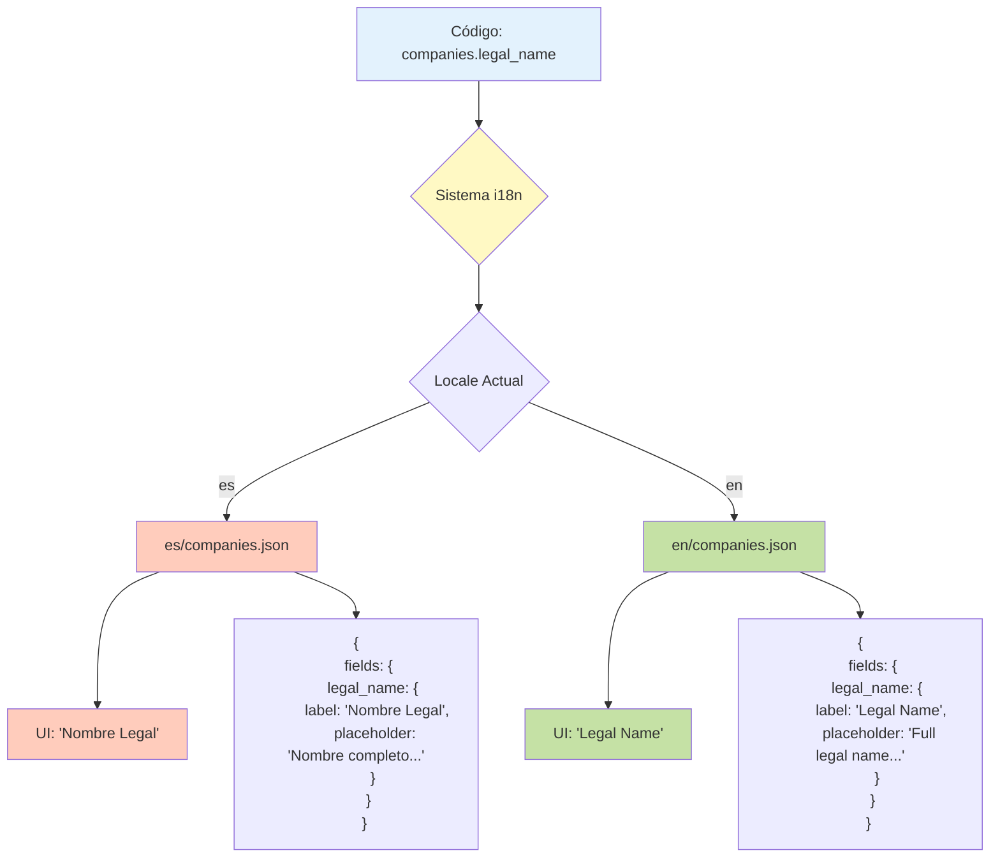

# Diagramas de Arquitectura del Esquema

## Índice
1. [Diagrama de Mapeo de Entidades](#diagrama-de-mapeo-de-entidades)
2. [Diagrama de Relaciones (Esquema Nuevo)](#diagrama-de-relaciones-esquema-nuevo)
3. [Flujo de Migración](#flujo-de-migración)
4. [Arquitectura de Catálogos](#arquitectura-de-catálogos)

## Diagrama de Mapeo de Entidades

Este diagrama muestra cómo las entidades actuales (español) se mapean a las nuevas entidades (inglés):

**Leyenda**:
- 🔴 Rojo: Entidades actuales (español)
- 🔵 Azul: Entidades nuevas (inglés) - Renombradas
- 🟢 Verde: Sin cambios

---

## Diagrama de Relaciones (Esquema Nuevo)

Este diagrama muestra las relaciones entre entidades en el nuevo esquema:

---

## Flujo de Migración

Este diagrama muestra el proceso de migración por fases:

---

## Arquitectura de Catálogos

Este diagrama muestra la arquitectura del sistema de catálogos:

---

## Diagrama de Estados (Companies)

Flujo de estados de una empresa en el sistema:

---

## Diagrama de Prioridad de Catálogos

Visualización de la prioridad de implementación de catálogos:

---

## Integración i18n

Flujo de traducción entre código y UI:

---

## Notas de Uso

### Visualización de Diagramas Mermaid

Los diagramas en este documento usan la sintaxis de Mermaid. Para visualizarlos:

1. **GitHub**: Se renderizan automáticamente en archivos `.md`
2. **VS Code**: Instalar extensión "Markdown Preview Mermaid Support"
3. **Online**: Usar [Mermaid Live Editor](https://mermaid.live)

### Actualización de Diagramas

Al modificar el esquema o las decisiones, actualizar los diagramas correspondientes:

1. Editar el código Mermaid en este archivo
2. Validar en Mermaid Live Editor
3. Verificar que se renderiza correctamente
4. Commit con mensaje descriptivo

## Referencias

- [Mapeo de Entidades](./MAPEO_ENTIDADES.md)
- [Decisiones de Duplicidades](./DECISIONES_DUPLICIDADES.md)
- [Glosario UI](./GLOSARIO_UI.md)
- [Inventario de Catálogos](./INVENTARIO_CATALOGOS.md)
- [README Fundacional](./README_FUNDACIONAL.md)
