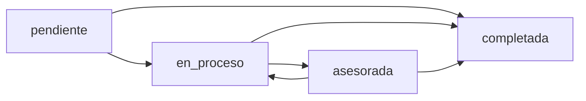
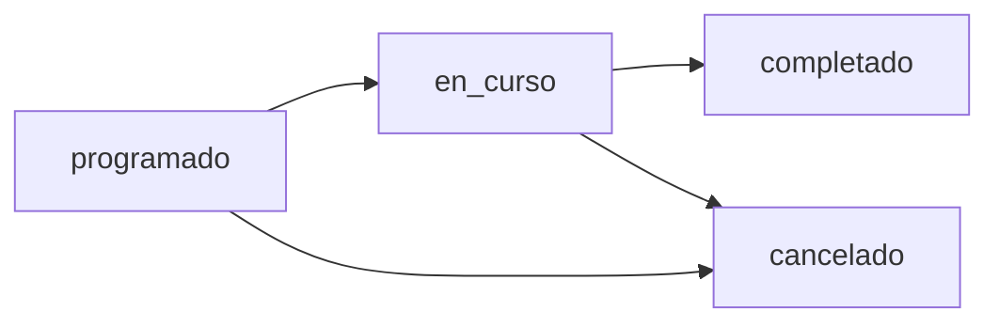
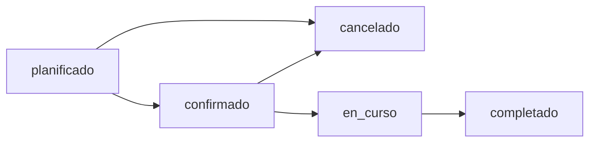
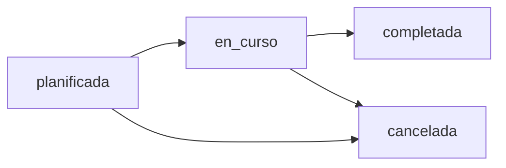
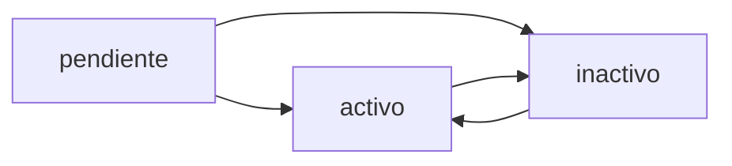

# Estados y Transiciones - Impulsa LOV

## Índice
1. [Introducción](#introducción)
2. [Estados de Empresa](#estados-de-empresa)
3. [Estados de Asesoramiento](#estados-de-asesoramiento)
4. [Estados de Evento](#estados-de-evento)
5. [Estados de Formación](#estados-de-formación)
6. [Estados de Colaborador](#estados-de-colaborador)
7. [Diagrama de Transiciones Globales](#diagrama-de-transiciones-globales)
8. [Reglas de Negocio](#reglas-de-negocio)

## Introducción

Este documento define los estados posibles para cada entidad del sistema y las transiciones válidas entre ellos. 

**ACTUALIZACIÓN (PR-6)**: A partir de ahora, el sistema implementa **validación funcional en el frontend** para las transiciones de estado. Las transiciones definidas en este documento son aplicadas mediante el módulo `src/lib/stateTransitions.ts`, que valida los cambios de estado y proporciona feedback claro cuando se intenta una transición no permitida.

**Importante**: La validación es solo en el frontend. El backend no aplica restricciones (RLS no modificado), pero el frontend guía a los usuarios para seguir los flujos correctos y prevenir errores.

## Estados de Empresa

### Estados Disponibles (ENUM: estado_empresa)

| Estado        | Descripción                                          | Color sugerido |
|--------------|------------------------------------------------------|----------------|
| `pendiente`  | Empresa registrada, sin asesoramiento iniciado       | Gris           |
| `en_proceso` | Empresa en proceso de asesoramiento                  | Azul           |
| `asesorada`  | Empresa ha recibido asesoramiento                    | Verde          |
| `completada` | Proceso de asesoramiento completado satisfactoriamente| Verde oscuro   |

### Transiciones Válidas (Implementado en PR-6)



**Validación implementada**: El sistema permite las transiciones mostradas arriba. Estado `completada` es terminal (no permite más cambios).

### Tabla de Transiciones

| Estado Actual | Estado Siguiente | Evento Disparador                              | Validaciones Recomendadas |
|--------------|------------------|------------------------------------------------|---------------------------|
| pendiente    | en_proceso       | Se asigna técnico o se programa primer asesoramiento | - Técnico asignado<br>- Asesoramiento programado |
| en_proceso   | asesorada        | Se completa al menos un asesoramiento          | - Al menos 1 asesoramiento completado |
| asesorada    | completada       | Se finaliza proceso de asesoramiento           | - Todos los asesoramientos completados<br>- Informe final generado (opcional) |
| en_proceso   | pendiente        | Se cancela o pausa el proceso                  | - Ninguna (reversión manual) |
| asesorada    | en_proceso       | Se requieren asesoramientos adicionales        | - Ninguna (ajuste manual) |
| completada   | asesorada        | Se reabre el caso                              | - Ninguna (reversión excepcional) |

### Reglas de Negocio Recomendadas

1. **Estado inicial**: Toda empresa nueva se crea con estado `pendiente`
2. **Progresión normal**: pendiente → en_proceso → asesorada → completada
3. **Regresiones permitidas**: Un caso puede volver a estados anteriores si es necesario
4. **Sin enforcement**: Los usuarios pueden cambiar manualmente entre cualquier estado
5. **Indicador complementario**: `es_caso_exito` puede marcarse en cualquier estado, típicamente en `completada`

### Campos Relacionados

- `fecha_inicio`: Se establece al pasar de `pendiente` a `en_proceso`
- `fecha_finalizacion`: Se establece al pasar a `completada`
- `codigo_motivo_cierre`: Se completa al pasar a `completada`
- `es_caso_exito`: Se puede marcar en estados `asesorada` o `completada`

---

## Estados de Asesoramiento

### Estados Disponibles (ENUM: estado_asesoramiento)

| Estado       | Descripción                                    | Color sugerido |
|-------------|------------------------------------------------|----------------|
| `programado` | Asesoramiento programado, aún no realizado     | Azul claro     |
| `en_curso`   | Asesoramiento en ejecución                     | Naranja        |
| `completado` | Asesoramiento finalizado exitosamente          | Verde          |
| `cancelado`  | Asesoramiento cancelado                        | Rojo           |

### Transiciones Válidas (Implementado en PR-6)



**Validación implementada**: El sistema permite las transiciones mostradas arriba. Estados `completado` y `cancelado` son terminales.

### Tabla de Transiciones

| Estado Actual | Estado Siguiente | Evento Disparador                        | Validaciones Recomendadas |
|--------------|------------------|------------------------------------------|---------------------------|
| programado   | en_curso         | Inicio del asesoramiento                 | - Fecha actual = fecha programada<br>- Técnico presente |
| en_curso     | completado       | Finalización del asesoramiento           | - Acta completada (opcional)<br>- Compromisos registrados (opcional) |
| programado   | cancelado        | Cancelación antes de iniciar             | - Motivo de cancelación (opcional) |
| en_curso     | cancelado        | Cancelación durante la sesión            | - Motivo de cancelación (recomendado) |
| cancelado    | programado       | Reprogramación                           | - Nueva fecha asignada |
| completado   | en_curso         | Corrección/revisión                      | - Ninguna (excepcional) |

### Reglas de Negocio Recomendadas

1. **Estado inicial**: Todo asesoramiento nuevo se crea con estado `programado`
2. **Progresión normal**: programado → en_curso → completado
3. **Cancelación**: Puede ocurrir desde `programado` o `en_curso`
4. **Reprogramación**: Un asesoramiento `cancelado` puede volver a `programado`
5. **Documentación**: Se recomienda completar acta, compromisos y próximos pasos al marcar como `completado`
6. **Informe**: El campo `informe_generado` se marca después de completar

### Campos Relacionados

- `acta`: Se completa típicamente en estado `completado`
- `compromisos`: Se completa en estado `completado`
- `proximos_pasos`: Se completa en estado `completado`
- `informe_generado`: Se marca como `true` después de `completado`

### Impacto en Empresa

- Cuando un asesoramiento pasa a `completado`, considerar actualizar el estado de la empresa a `asesorada`
- Si todos los asesoramientos están completados, considerar estado `completada` para la empresa

---

## Estados de Evento

### Estados Disponibles (ENUM: estado_evento)

| Estado       | Descripción                                    | Color sugerido |
|-------------|------------------------------------------------|----------------|
| `planificado`| Evento en planificación inicial                | Gris           |
| `confirmado` | Evento confirmado con fecha y ubicación        | Azul           |
| `en_curso`   | Evento en ejecución                            | Naranja        |
| `completado` | Evento finalizado exitosamente                 | Verde          |
| `cancelado`  | Evento cancelado                               | Rojo           |

### Transiciones Válidas (Implementado en PR-6)



**Validación implementada**: El sistema permite las transiciones mostradas arriba. Estados `completado` y `cancelado` son terminales. No se permite cancelar desde `en_curso`.

### Tabla de Transiciones

| Estado Actual | Estado Siguiente | Evento Disparador                        | Validaciones Recomendadas |
|--------------|------------------|------------------------------------------|---------------------------|
| planificado  | confirmado       | Confirmación de fecha, hora y ubicación  | - Fecha definida<br>- Ubicación definida<br>- Ponentes confirmados |
| confirmado   | en_curso         | Inicio del evento                        | - Fecha actual = fecha del evento |
| en_curso     | completado       | Finalización del evento                  | - Asistentes confirmados registrados |
| planificado  | cancelado        | Cancelación en planificación             | - Motivo en observaciones |
| confirmado   | cancelado        | Cancelación después de confirmación      | - Notificación a asistentes |
| en_curso     | cancelado        | Cancelación durante ejecución            | - Motivo crítico (excepcional) |
| cancelado    | planificado      | Replanificación                          | - Nueva fecha |
| confirmado   | planificado      | Cambio significativo que requiere replanificación | - Actualización de datos |

### Reglas de Negocio Recomendadas

1. **Estado inicial**: Todo evento nuevo se crea con estado `planificado`
2. **Progresión normal**: planificado → confirmado → en_curso → completado
3. **Confirmación**: Requiere tener definida fecha, hora y ubicación
4. **Asistencia**: Se actualiza `asistentes_confirmados` durante los estados `confirmado` y `en_curso`
5. **Finalización**: Al pasar a `completado`, registrar el número final de asistentes
6. **Evidencias**: Se recomienda crear evidencias (fotos, videos) para eventos completados

### Campos Relacionados

- `fecha`: Debe estar definida antes de pasar a `confirmado`
- `hora_inicio`: Debe estar definida antes de pasar a `confirmado`
- `ubicacion`: Debe estar definida antes de pasar a `confirmado` (para eventos presenciales)
- `ponentes`: Recomendado confirmar antes de pasar a `confirmado`
- `asistentes_esperados`: Se define en `planificado` o `confirmado`
- `asistentes_confirmados`: Se actualiza en `confirmado` y `en_curso`, se finaliza en `completado`

---

## Estados de Formación

### Estados Disponibles (ENUM: estado_formacion)

| Estado       | Descripción                                    | Color sugerido |
|-------------|------------------------------------------------|----------------|
| `planificada`| Formación en planificación                     | Gris           |
| `en_curso`   | Formación en ejecución                         | Naranja        |
| `completada` | Formación finalizada exitosamente              | Verde          |
| `cancelada`  | Formación cancelada                            | Rojo           |

### Transiciones Válidas (Implementado en PR-6)



**Validación implementada**: El sistema permite las transiciones mostradas arriba. Estados `completada` y `cancelada` son terminales.

### Tabla de Transiciones

| Estado Actual | Estado Siguiente | Evento Disparador                        | Validaciones Recomendadas |
|--------------|------------------|------------------------------------------|---------------------------|
| planificada  | en_curso         | Inicio de la formación                   | - Fecha inicio = fecha actual<br>- Formador confirmado<br>- Participantes inscritos > 0 |
| en_curso     | completada       | Finalización de la formación             | - Fecha actual >= fecha_fin<br>- Materiales entregados (opcional) |
| planificada  | cancelada        | Cancelación antes de iniciar             | - Motivo en observaciones<br>- Notificación a inscritos |
| en_curso     | cancelada        | Cancelación durante ejecución            | - Motivo crítico (excepcional)<br>- Gestión de certificaciones parciales |
| cancelada    | planificada      | Replanificación                          | - Nueva fecha de inicio |
| completada   | en_curso         | Corrección/revisión                      | - Ninguna (excepcional) |

### Reglas de Negocio Recomendadas

1. **Estado inicial**: Toda formación nueva se crea con estado `planificada`
2. **Progresión normal**: planificada → en_curso → completada
3. **Inscripciones**: Se gestionan durante `planificada` y `en_curso`
4. **Límite de participantes**: `participantes_inscritos` no debe exceder `participantes_max`
5. **Materiales**: Se preparan en `planificada` y se entregan en `en_curso`
6. **Certificados**: Se generan como evidencias después de `completada`
7. **Evaluación**: Se recomienda evaluar después de `completada`

### Campos Relacionados

- `fecha_inicio`: Debe estar definida antes de pasar a `en_curso`
- `fecha_fin`: Debe estar definida (puede ser estimada)
- `formador`: Debe estar confirmado antes de pasar a `en_curso`
- `participantes_inscritos`: Se actualiza durante `planificada` y `en_curso`
- `participantes_max`: Se define en `planificada`
- `materiales`: Se preparan en `planificada`, se entregan en `en_curso`
- `modalidad`: Se define en `planificada` (presencial, online, hibrida)
- `ubicacion`: Obligatoria para modalidad presencial/hibrida

---

## Estados de Colaborador

### Estados Disponibles (ENUM: estado_colaborador)

| Estado       | Descripción                                    | Color sugerido |
|-------------|------------------------------------------------|----------------|
| `pendiente`  | Colaborador en proceso de evaluación           | Gris           |
| `activo`     | Colaborador activo en el programa              | Verde          |
| `inactivo`   | Colaborador inactivo o suspendido              | Rojo           |

### Transiciones Válidas (Implementado en PR-6)



**Validación implementada**: El sistema permite las transiciones mostradas arriba. Todos los estados permiten transiciones, ninguno es terminal.

### Tabla de Transiciones

| Estado Actual | Estado Siguiente | Evento Disparador                        | Validaciones Recomendadas |
|--------------|------------------|------------------------------------------|---------------------------|
| pendiente    | activo           | Aprobación y activación del colaborador  | - Convenio firmado (recomendado)<br>- Datos de contacto completos<br>- Ámbito de colaboración definido |
| activo       | inactivo         | Suspensión o fin de la colaboración      | - Motivo en observaciones |
| inactivo     | activo           | Reactivación del colaborador             | - Renovación de convenio (si corresponde) |
| pendiente    | inactivo         | Rechazo o descarte del colaborador       | - Motivo en observaciones |

### Reglas de Negocio Recomendadas

1. **Estado inicial**: Todo colaborador nuevo se crea con estado `pendiente`
2. **Activación**: Requiere completar datos básicos y preferiblemente firmar convenio
3. **Convenio**: El campo `convenio_firmado` complementa el estado, típicamente `true` para colaboradores `activo`
4. **Reactivación**: Un colaborador `inactivo` puede volver a `activo` si se renueva la colaboración
5. **KPIs**: Solo colaboradores en estado `activo` con `convenio_firmado = true` cuentan para KPIs
6. **Asignación**: El campo `asignado_a` puede definirse en cualquier estado

### Campos Relacionados

- `convenio_firmado`: Típicamente `true` para colaboradores `activo`
- `fecha_inicio_colaboracion`: Se registra al pasar a `activo` (o antes)
- `ambito_colaboracion`: Debe estar definido antes de pasar a `activo`
- `sectores_interes`: Recomendado definir antes de activar
- `tipos_apoyo`: Recomendado definir antes de activar
- `asignado_a`: Usuario técnico responsable del seguimiento

### Casos de Uso

1. **Nuevo colaborador**: 
   - Se registra en estado `pendiente`
   - Se evalúa y completa información
   - Se activa a estado `activo` con o sin convenio
   - Posteriormente se marca `convenio_firmado = true`

2. **Fin de colaboración**:
   - Se cambia de `activo` a `inactivo`
   - Se documenta motivo en `observaciones`
   - Se preservan datos históricos

3. **Renovación**:
   - Se cambia de `inactivo` a `activo`
   - Se actualiza `convenio_firmado` si aplica
   - Se puede actualizar `fecha_inicio_colaboracion`

---

## Diagrama de Transiciones Globales

### Flujo Típico del Sistema

```
USUARIO REGISTRADO
       │
       ▼
  [EMPRESA: pendiente]
       │
       ├─► Asignar técnico
       │
       ▼
  [EMPRESA: en_proceso]
       │
       ├─► Crear contactos
       │
       ├─► Programar asesoramiento
       │
       ▼
  [ASESORAMIENTO: programado]
       │
       ├─► Iniciar asesoramiento
       │
       ▼
  [ASESORAMIENTO: en_curso]
       │
       ├─► Completar asesoramiento
       │
       ▼
  [ASESORAMIENTO: completado]
       │
       ├─► Generar informe
       │
       ├─► Crear evidencias
       │
       ▼
  [EMPRESA: asesorada]
       │
       ├─► Más asesoramientos (loop)
       │
       ├─► Finalizar proceso
       │
       ▼
  [EMPRESA: completada]
       │
       ├─► Marcar como caso de éxito
       │
       ▼
  [EMPRESA: es_caso_exito = true]


ACTIVIDADES COMPLEMENTARIAS
       │
       ├─► [EVENTO: planificado] → confirmado → en_curso → completado
       │
       ├─► [FORMACIÓN: planificada] → en_curso → completada
       │
       ├─► [COLABORADOR: pendiente] → activo
       │
       └─► [EVIDENCIAS] (relacionadas con todo lo anterior)
```

---

## Reglas de Negocio

### Reglas Globales

1. **Sin enforcement automático**: El sistema no fuerza transiciones específicas, pero documenta las recomendadas
2. **Cambios manuales permitidos**: Usuarios con permisos pueden cambiar cualquier estado manualmente
3. **Auditoría**: El campo `updated_at` registra automáticamente cambios de estado
4. **Historial**: Se recomienda implementar tabla de historial de estados (no incluida en v1.0)

### Reglas por Rol

**Administradores**:
- Pueden cambiar cualquier estado de cualquier entidad
- Pueden revertir estados (ej: completado → en_proceso)
- Pueden forzar estados no convencionales

**Técnicos**:
- Pueden cambiar estados de entidades que gestionan
- Deben seguir flujos recomendados (no obligatorios)
- Pueden crear evidencias y documentación

### Validaciones Recomendadas (No Obligatorias)

#### Para Empresa
- **en_proceso**: Debe tener técnico asignado O al menos un asesoramiento programado
- **asesorada**: Debe tener al menos un asesoramiento completado
- **completada**: Recomendado tener informe generado y fecha de finalización

#### Para Asesoramiento
- **completado**: Recomendado tener acta, compromisos y próximos pasos
- **cancelado**: Recomendado documentar motivo en observaciones

#### Para Evento
- **confirmado**: Debe tener fecha, hora y ubicación definidas
- **completado**: Debe tener número de asistentes confirmados actualizado

#### Para Formación
- **en_curso**: Debe tener fecha de inicio y formador definidos
- **completada**: Debe tener participantes inscritos > 0

#### Para Colaborador
- **activo**: Recomendado tener convenio firmado y ámbito de colaboración definido

### Alertas y Notificaciones (Recomendadas)

1. **Asesoramiento programado próximo**: Alertar 24-48h antes
2. **Asesoramiento sin completar**: Alertar si pasan 7 días desde la fecha programada
3. **Empresa en_proceso estancada**: Alertar si lleva >30 días sin asesoramientos
4. **Evento confirmado próximo**: Alertar 1 semana antes
5. **Formación con baja inscripción**: Alertar si participantes < 50% del máximo
6. **Colaborador pendiente antiguo**: Alertar si lleva >15 días en estado pendiente

### Estadísticas por Estado (Sugeridas)

Para cada entidad con estados, se recomienda mantener:
- Tiempo promedio en cada estado
- Tasa de conversión entre estados
- Número de reversiones (cambios hacia atrás)
- Estados más frecuentes
- Cuellos de botella (estados donde las entidades se quedan mucho tiempo)

### Migración y Datos Históricos

- Al cambiar estados, preservar datos históricos
- No eliminar información de estados anteriores
- Considerar tabla de log de cambios de estado para auditoría completa
- Permitir análisis retrospectivo de flujos

---

## Notas Importantes

1. **Flexibilidad**: El sistema permite flexibilidad en las transiciones para adaptarse a casos excepcionales

2. **Documentación**: Esta documentación sirve como guía, no como restricción técnica

3. **Mejora continua**: Las transiciones pueden refinarse según la experiencia de uso

4. **Campos complementarios**: Los estados se complementan con otros campos (fechas, banderas, observaciones)

5. **Reportes**: Los estados permiten generar reportes del flujo de trabajo

6. **Sin bloqueos**: Ninguna transición está bloqueada técnicamente

7. **Reversibilidad**: Casi todas las transiciones son reversibles para corregir errores

8. **Consistencia**: Se recomienda seguir los flujos documentados para mantener la coherencia del sistema

9. **Futuras mejoras**: Podría implementarse un sistema de workflow con enforcement opcional en versiones futuras

10. **Integración**: Los estados deben sincronizarse correctamente con sistemas externos (PowerBI, etc.)

## Implementación de Validación (PR-6)

### Módulo de Validación

La validación de transiciones de estado se implementa en el módulo `src/lib/stateTransitions.ts`, que proporciona:

1. **`canTransition(entityType, currentState, newState)`**: Valida si una transición es permitida
2. **`getValidNextStates(entityType, currentState)`**: Obtiene los estados válidos siguientes
3. **`getTransitionErrorMessage(entityType, currentState, attemptedState)`**: Genera mensajes de error amigables

### Características

- **Validación solo en frontend**: No se modifican reglas de backend ni RLS
- **Estados terminales**: Algunos estados no permiten más transiciones
- **Feedback claro**: Mensajes de error descriptivos cuando se intenta una transición inválida
- **Sin cambios estéticos**: La UI se mantiene igual, solo se añade validación funcional

### Uso en Formularios

El módulo se integra en los formularios de creación/edición de entidades:
- Al cambiar el estado, se valida la transición
- Si es inválida, se muestra un toast con el mensaje de error
- Solo se permite seleccionar estados válidos desde el estado actual

### Testing

Para probar las transiciones, intente cambiar estados en el orden inverso o saltando pasos para ver las validaciones en acción.
