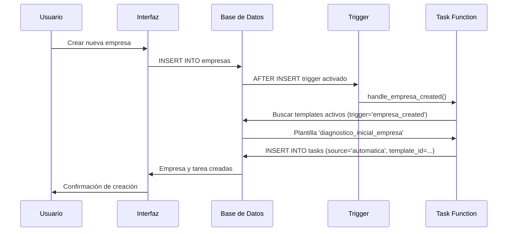

# Flujo de Tareas Automáticas

## Descripción General

Este documento describe el sistema de plantillas de tareas (task templates) y las reglas automáticas para la creación de tareas en el sistema impulsa-lov. El sistema permite la creación automática de tareas cuando ocurren ciertos eventos, como la creación de una nueva empresa.

## Componentes del Sistema

### 1. Tabla `task_templates`

La tabla `task_templates` almacena las plantillas que definen cómo se deben crear las tareas automáticas.

#### Estructura de la Tabla

```sql
CREATE TABLE public.task_templates (
  id UUID PRIMARY KEY,
  name TEXT NOT NULL UNIQUE,
  trigger template_trigger NOT NULL,
  title_template TEXT NOT NULL,
  description_template TEXT,
  default_due_days INTEGER,
  default_priority task_priority DEFAULT 'medium',
  default_estado task_status DEFAULT 'pending',
  required_role app_role,
  assign_to_creator BOOLEAN DEFAULT false,
  is_active BOOLEAN DEFAULT true,
  metadata JSONB,
  tags TEXT[],
  created_at TIMESTAMP WITH TIME ZONE,
  updated_at TIMESTAMP WITH TIME ZONE
)
```

#### Campos Principales

- **name**: Identificador único de la plantilla
- **trigger**: Evento que dispara la creación de la tarea (ver tipos de triggers más abajo)
- **title_template**: Plantilla para el título de la tarea
- **description_template**: Plantilla para la descripción de la tarea
- **default_due_days**: Número de días desde la creación para establecer como fecha de vencimiento
- **default_priority**: Prioridad por defecto (low, medium, high, urgent)
- **default_estado**: Estado inicial de la tarea (pending, in_progress, completed, cancelled, on_hold)
- **required_role**: Rol requerido para asignar la tarea (admin, tecnico)
- **assign_to_creator**: Si es true, asigna la tarea al usuario que creó la entidad
- **is_active**: Indica si la plantilla está activa
- **metadata**: Configuración adicional en formato JSON
- **tags**: Etiquetas por defecto para las tareas creadas

### 2. Tipo de Enum `template_trigger`

Define los eventos que pueden disparar la creación automática de tareas:

```sql
CREATE TYPE template_trigger AS ENUM (
  'empresa_created',
  'evento_created',
  'formacion_created',
  'colaborador_created',
  'opportunity_created',
  'grant_created',
  'manual'
);
```

### 3. Extensión de la Tabla `tasks`

Se han añadido los siguientes campos a la tabla `tasks`:

- **template_id**: Referencia UUID a la plantilla que generó la tarea (si aplica)
- **source**: Campo TEXT que indica el origen de la tarea:
  - `manual`: Creada manualmente por un usuario
  - `automatica`: Creada automáticamente desde una plantilla
  - `imported`: Importada desde sistemas externos
  - `workflow`: Creada por flujos de trabajo automatizados
  - `integration`: Creada desde integraciones

## Reglas Automáticas Implementadas

### Regla 1: Diagnóstico Inicial al Crear Empresa

Cuando se crea una nueva empresa en el sistema, automáticamente se genera una tarea de "Diagnóstico inicial".

#### Configuración de la Plantilla

```sql
INSERT INTO task_templates (
  name: 'diagnostico_inicial_empresa',
  trigger: 'empresa_created',
  title_template: 'Diagnóstico inicial',
  description_template: 'Realizar el diagnóstico inicial de la empresa...',
  default_due_days: 7,
  default_priority: 'high',
  default_estado: 'pending',
  required_role: 'tecnico',
  is_active: true,
  tags: ['diagnostico', 'inicial', 'empresa']
)
```

#### Características de la Tarea Generada

- **Título**: "Diagnóstico inicial"
- **Descripción**: Texto descriptivo sobre el objetivo del diagnóstico
- **Fecha de vencimiento**: 7 días desde la creación de la empresa
- **Prioridad**: Alta
- **Estado inicial**: Pendiente
- **Vinculación**: Se vincula automáticamente con la empresa creada (entity_type='empresa', entity_id=id_empresa)
- **Source**: 'automatica'
- **Template ID**: Referencia a la plantilla 'diagnostico_inicial_empresa'

## Implementación Técnica

### Funciones SQL

#### `create_tasks_from_templates()`

Función genérica que crea tareas desde plantillas activas basándose en un evento trigger.

```sql
CREATE FUNCTION create_tasks_from_templates(
  p_trigger template_trigger,
  p_entity_type task_entity_type,
  p_entity_id UUID,
  p_created_by UUID
) RETURNS void
```

**Parámetros**:
- `p_trigger`: Tipo de evento que disparó la creación
- `p_entity_type`: Tipo de entidad relacionada
- `p_entity_id`: ID de la entidad relacionada
- `p_created_by`: ID del usuario que creó la entidad

**Lógica**:
1. Busca todas las plantillas activas para el trigger especificado
2. Para cada plantilla:
   - Calcula la fecha de vencimiento según `default_due_days`
   - Determina el responsable según las reglas de asignación
   - Crea la tarea con los valores de la plantilla
   - Marca la tarea como `source='automatica'`
   - Vincula la tarea con el template_id

#### `handle_empresa_created()`

Función trigger específica para el evento de creación de empresa.

```sql
CREATE FUNCTION handle_empresa_created() RETURNS TRIGGER
```

Se ejecuta **AFTER INSERT** en la tabla `empresas` y llama a `create_tasks_from_templates()` con los parámetros apropiados.

### Triggers de Base de Datos

```sql
CREATE TRIGGER trigger_empresa_created_tasks
  AFTER INSERT ON public.empresas
  FOR EACH ROW
  EXECUTE FUNCTION handle_empresa_created();
```

## Permisos y Seguridad (RLS)

### Tabla `task_templates`

- **SELECT**: Todos los usuarios autenticados con roles pueden ver las plantillas
- **INSERT**: Solo administradores pueden crear plantillas
- **UPDATE**: Solo administradores pueden modificar plantillas
- **DELETE**: Solo administradores pueden eliminar plantillas

### Tabla `tasks`

Las tareas automáticas heredan las mismas políticas RLS que las tareas manuales:

- **SELECT**: Todos los usuarios autenticados con roles
- **INSERT**: Usuarios con rol admin o tecnico
- **UPDATE**: 
  - Admins: Todas las tareas
  - Tecnicos: Solo sus tareas creadas o asignadas
- **DELETE**: Solo administradores

**Importante**: Las tareas automáticas son editables igual que las manuales. No hay bloqueo por el campo `source`.

## Uso del Sistema

### Para Administradores

#### Crear una Nueva Plantilla

1. Insertar en la tabla `task_templates` con los valores deseados
2. Asegurarse de que `is_active = true`
3. Configurar el `trigger` apropiado
4. Definir las reglas de asignación (`required_role`, `assign_to_creator`)

Ejemplo:
```sql
INSERT INTO task_templates (
  name,
  trigger,
  title_template,
  description_template,
  default_due_days,
  default_priority,
  required_role,
  is_active
) VALUES (
  'primera_reunion_empresa',
  'empresa_created',
  'Programar primera reunión',
  'Contactar con la empresa para programar la primera reunión de asesoramiento',
  3,
  'high',
  'tecnico',
  true
);
```

#### Desactivar una Plantilla

```sql
UPDATE task_templates 
SET is_active = false 
WHERE name = 'diagnostico_inicial_empresa';
```

#### Modificar una Plantilla Existente

```sql
UPDATE task_templates 
SET default_due_days = 14,
    description_template = 'Nueva descripción...'
WHERE name = 'diagnostico_inicial_empresa';
```

### Para Usuarios (Técnicos/Admins)

#### Editar Tareas Automáticas

Las tareas creadas automáticamente aparecen en la interfaz de tareas con:
- Campo `source = 'automatica'`
- Badge o indicador visual que muestra su origen
- Campo `template_id` que referencia la plantilla original

Estas tareas pueden ser editadas libremente:
- Cambiar título, descripción, fechas
- Reasignar responsable
- Modificar estado y prioridad
- Añadir observaciones

No hay restricciones especiales para tareas automáticas vs manuales.

## Flujo de Creación de Empresa con Tarea Automática



## Índices y Optimización

### Índices en `task_templates`
- `idx_task_templates_trigger`: Para búsquedas por trigger
- `idx_task_templates_is_active`: Para filtrar plantillas activas
- `idx_task_templates_name`: Para búsquedas por nombre

### Índices en `tasks` (nuevos)
- `idx_tasks_template_id`: Para consultas relacionadas con plantillas
- `idx_tasks_source`: Para filtrar por tipo de origen

## Extensibilidad

### Añadir Nuevos Triggers

Para añadir un nuevo evento que dispare tareas automáticas:

1. Añadir el nuevo valor al enum `template_trigger` si no existe
2. Crear una función trigger específica para la tabla (similar a `handle_empresa_created`)
3. Asociar el trigger a la tabla correspondiente
4. Crear las plantillas necesarias para ese trigger

Ejemplo para eventos:
```sql
CREATE FUNCTION handle_evento_created() RETURNS TRIGGER AS $$
BEGIN
  PERFORM create_tasks_from_templates(
    'evento_created'::template_trigger,
    'evento'::task_entity_type,
    NEW.id,
    COALESCE(NEW.created_by, auth.uid())
  );
  RETURN NEW;
END;
$$ LANGUAGE plpgsql SECURITY DEFINER;

CREATE TRIGGER trigger_evento_created_tasks
  AFTER INSERT ON public.eventos
  FOR EACH ROW
  EXECUTE FUNCTION handle_evento_created();
```

### Plantillas con Variables

En futuras versiones, se pueden implementar plantillas con sustitución de variables:

```sql
title_template: 'Diagnóstico inicial - {{empresa.nombre}}'
description_template: 'Realizar diagnóstico para {{empresa.nombre}} del sector {{empresa.sector}}'
```

Esto requeriría modificar la función `create_tasks_from_templates` para realizar sustituciones dinámicas.

## Monitoreo y Estadísticas

### Consultar Tareas Automáticas por Plantilla

```sql
SELECT 
  t.titulo,
  t.estado,
  t.created_at,
  tt.name as template_name
FROM tasks t
JOIN task_templates tt ON t.template_id = tt.id
WHERE tt.name = 'diagnostico_inicial_empresa'
ORDER BY t.created_at DESC;
```

### Estadísticas de Uso de Plantillas

```sql
SELECT 
  tt.name,
  tt.trigger,
  COUNT(t.id) as tasks_created,
  COUNT(CASE WHEN t.estado = 'completed' THEN 1 END) as tasks_completed
FROM task_templates tt
LEFT JOIN tasks t ON t.template_id = tt.id
GROUP BY tt.id, tt.name, tt.trigger
ORDER BY tasks_created DESC;
```

## Mejores Prácticas

1. **Mantener plantillas simples**: Evitar lógica compleja en las plantillas
2. **Revisar periódicamente**: Evaluar la efectividad de las plantillas y ajustar
3. **Documentar cambios**: Registrar modificaciones a plantillas en metadata
4. **Pruebas antes de activar**: Probar nuevas plantillas con `is_active = false` primero
5. **No eliminar plantillas en uso**: Desactivar en lugar de eliminar para mantener referencias
6. **Monitorear tareas automáticas**: Revisar regularmente que las tareas se crean correctamente

## Limitaciones Conocidas

1. **Asignación automática**: Actualmente las tareas no se asignan automáticamente a usuarios específicos, solo se marca el `required_role`. La asignación debe hacerse manualmente.
2. **Sin notificaciones**: No hay sistema de notificaciones automáticas cuando se crea una tarea automática
3. **Plantillas estáticas**: No soportan variables dinámicas en título/descripción
4. **Un trigger por evento**: Actualmente solo se ejecuta al crear entidades, no al actualizarlas o cambiar estados

## Futuras Mejoras

- Sistema de notificaciones para tareas automáticas
- Asignación inteligente basada en carga de trabajo
- Plantillas con variables dinámicas
- Triggers condicionales (solo crear tarea si se cumplen ciertas condiciones)
- Tareas recurrentes automáticas
- Dashboard de monitoreo de plantillas
- Historial de cambios en plantillas
- Dependencias entre tareas automáticas
